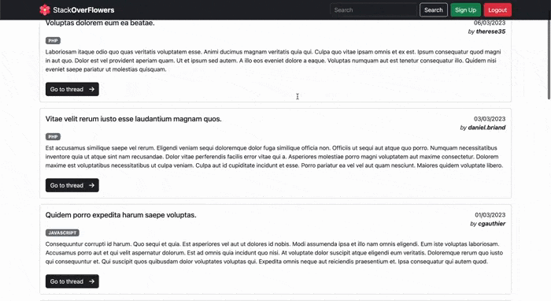
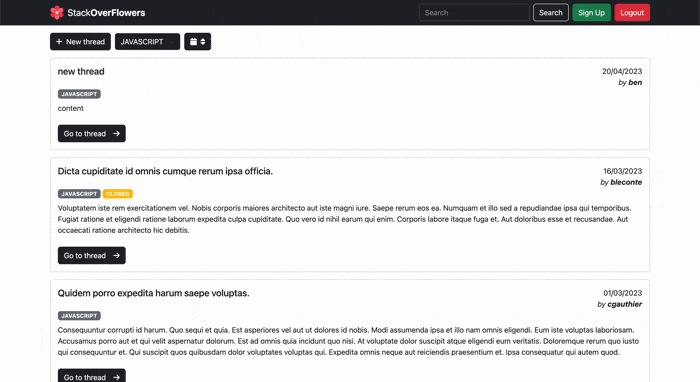
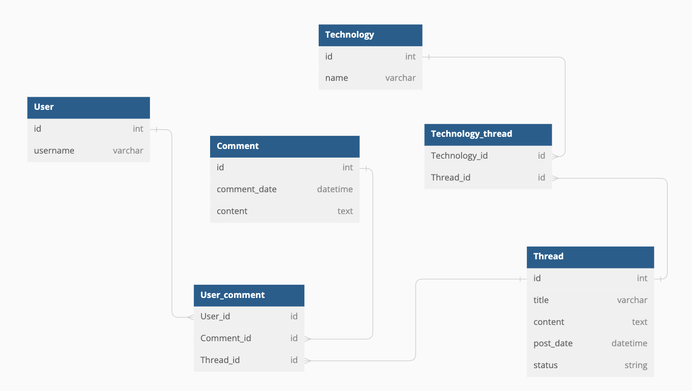

# StackOverFlowers

This is a student project.  
It's a StackOverFlow clone (without a few small features)  
For admin access, please Sign Up and modify your role in database with ["ROLE_ADMIN"]

## DEMO

### User usage

As a user you can create threads and comment on those that are not closed or moderated

### Admin usage

As an admin you can edit or delete comments and threads

### DataBase structure

<<<<<<< HEAD